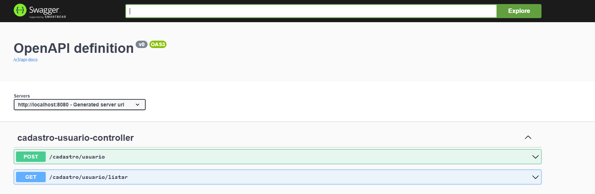
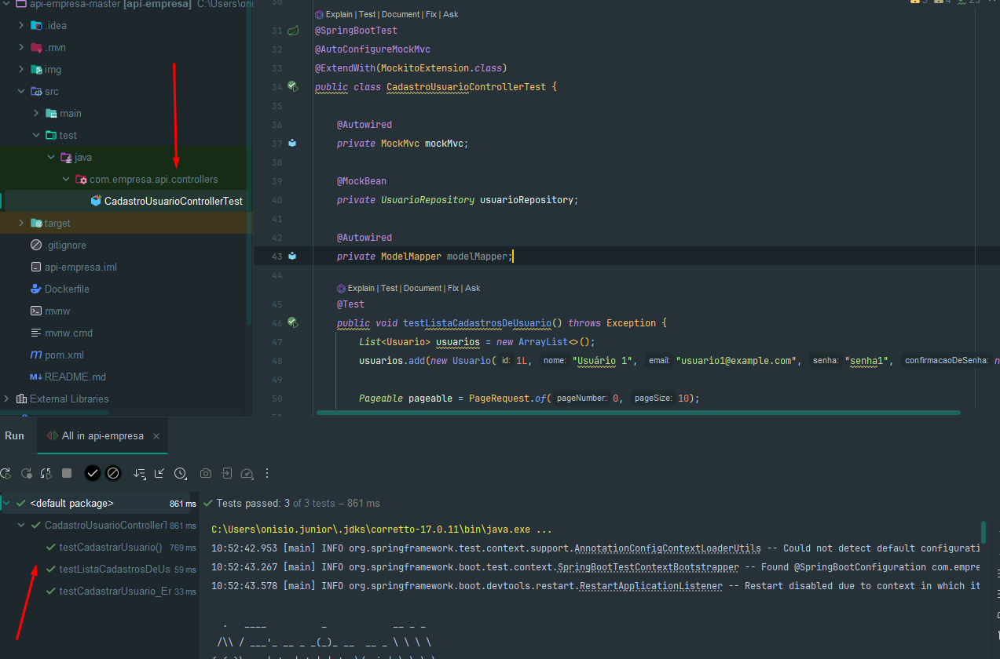

## 👉First Decision - Backend 💪✔️

### 1. Descrição do Projeto
Cadastro de Usuário.

### 2. Características Principais
Este projeto foi desenvolvido utilizando as seguintes ferramentas:
- Spring boot Versão: 3.2.3
- Java JDK versión:17
- Apache Maven  Versão: 3.3.9
- OpenAPI and Swagger: 2.0.4
- Lombok
- Base de dados Postgres
- Mockito: 5.11.0
- Junit: 5.10.2
- flywaydb 

### 3. Swagger

- Dependencias:

```
		<!-- https://mvnrepository.com/artifact/org.springdoc/springdoc-openapi-starter-webmvc-ui -->
		<dependency>
			<groupId>org.springdoc</groupId>
			<artifactId>springdoc-openapi-starter-webmvc-ui</artifactId>
			<version>2.0.4</version>
		</dependency>

		<!-- https://mvnrepository.com/artifact/org.springframework.boot/spring-boot-starter-validation -->
		<dependency>
			<groupId>org.springframework.boot</groupId>
			<artifactId>spring-boot-starter-validation</artifactId>
		</dependency>
```
- URL Swagger: http://localhost:8080/swagger-ui/index.html

- Visualização de tela



### 4. Mockito

- Dependencias:

```
        <dependency>
            <groupId>org.junit.jupiter</groupId>
            <artifactId>junit-jupiter-engine</artifactId>
            <version>5.10.2</version>
            <scope>test</scope>
        </dependency>
        <dependency>
            <groupId>org.mockito</groupId>
            <artifactId>mockito-core</artifactId>
            <version>5.11.0</version>
            <scope>test</scope>
        </dependency>
```

#### 4.1. Pruebas unitarias
- Visualización pruebas unitarias:



### 5. EndPoints

- EndPoint: Cadastrar-usuario:  http://localhost:8080/cadastro/usuario
    
  ```
    {
  
  "nome": "Nome Teste",
  "email": "email@teste.com",
  "senha": "senha123",
  "confirmacaoDeSenha": "senha123",
  }
   ```
  
- EndPoint: Listar-Usuarios: http://localhost:8080/cadastro/usuario/listar?page=0&size=10&sort=nome%2Casc


```
       {
        "page": 0,
        "size": 10,
        "sort": "nome,asc"
      }

```


### 3. Docker
#### 3.1. Dockerfile
```
FROM openjdk:17
VOLUME /tmp
EXPOSE 8080
ADD ./target/api-empresa-3.2.5.jar api-empresa.jar
ENTRYPOINT ["java","-jar","/api-empresa.jar"]
```
#### 3.2. Geração de imagem
- Criamos a imagem a partir do terminal PowerShell..
```
docker build -t api-empresa:v1 .
```


#### 3.3. Criação de Rede
```
docker network create red-api-empresa
```


#### 3.4. Criação de contêiner

- Eu gero o contêiner com a imagem gerada anteriormente.
```
docker run -p 8080:8080 --name Nomedocontainer --network red-api-empresa  api-empresa:v1
```
🚧🚨⛔ATENÇÃO: Ao tentar gerar o contêiner, Pode ocorre um  erro. Isso ocorre devido a um problema de comunicação entre o contêiner e o banco de dados instalado na máquina física (Host).
